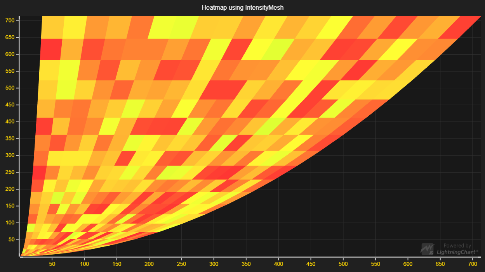

# Heatmap Mesh



This demo application belongs to the set of examples for LightningChart JS, data visualization library for JavaScript.

LightningChart JS is entirely GPU accelerated and performance optimized charting library for presenting massive amounts of data. It offers an easy way of creating sophisticated and interactive charts and adding them to your website or web application.

The demo can be used as an example or a seed project. Local execution requires the following steps:

- Make sure that relevant version of [Node.js](https://nodejs.org/en/download/) is installed
- Open the project folder in a terminal:

        npm install              # fetches dependencies
        npm start                # builds an application and starts the development server

- The application is available at *http://localhost:8080* in your browser, webpack-dev-server provides hot reload functionality.


## Description

This example shows a simple use-case scenario for mesh-based Heatmaps.

Heatmaps are a powerful tool for visualizing magnitude in two dimensions. This example focuses on the IntensityMesh-type Heatmap Series. The difference between grid and mesh types is apparent in the naming; whereas grid is always a rectangular shape, the mesh type allows users to modify the geometry of the shape.

Heatmaps can be created in XY Charts:
```javascript
// Add heatmap Series to a XY Chart
chartXY.addHeatmapSeries( {
    rows:       verticalResolution,
    columns:    horizontalResolution,
    start:      { x: 0, y: 0 },
    end:        { x: 100, y: 100 },
    pixelate:   false,
    // Make sure we're using the Mesh IntensitySeriesType
    type:       IntensitySeriesTypes.Mesh
})
```

The *Mesh IntensitySeriesType* has the same API that is available with the *Grid IntensitySeriesType*, but in addition it has the *invalidateGeometryOnly* method:

```javascript
// Use invalidateGeometryOnly to edit the geometry of the heatmap and invalidate it.
// This can be done by supplying a Matrix of Points to the method.
heatmap.invalidateGeometryOnly( vertices: Matrix<Point> )
// Optionally, the geometry can be modified by supplying the method with a callback
// which modifies each point.
heatmap.invalidateGeometryOnly( vertices: UpdateGeometryCallback )
```


## API Links

* [XY cartesian chart]
* [Intensity Mesh Series]
* [IndividualPointFill]
* [ColorHSV]
* [Matrix]
* [UpdateGeometryCallback]


## Support

If you notice an error in the example code, please open an issue on [GitHub][0] repository of the entire example.

Official [API documentation][1] can be found on [Arction][2] website.

If the docs and other materials do not solve your problem as well as implementation help is needed, ask on [StackOverflow][3] (tagged lightningchart).

If you think you found a bug in the LightningChart JavaScript library, please contact support@arction.com.

Direct developer email support can be purchased through a [Support Plan][4] or by contacting sales@arction.com.

[0]: https://github.com/Arction/
[1]: https://www.arction.com/lightningchart-js-api-documentation/
[2]: https://www.arction.com
[3]: https://stackoverflow.com/questions/tagged/lightningchart
[4]: https://www.arction.com/support-services/

© Arction Ltd 2009-2020. All rights reserved.


[XY cartesian chart]: https://www.arction.com/lightningchart-js-api-documentation/v2.1.0/classes/chartxy.html
[Intensity Mesh Series]: https://www.arction.com/lightningchart-js-api-documentation/v2.1.0/classes/intensitymeshseries.html
[IndividualPointFill]: https://www.arction.com/lightningchart-js-api-documentation/v2.1.0/classes/individualpointfill.html
[ColorHSV]: https://www.arction.com/lightningchart-js-api-documentation/v2.1.0/globals.html#colorhsv
[Matrix]: https://www.arction.com/lightningchart-js-api-documentation/v2.1.0/globals.html#matrix
[UpdateGeometryCallback]: https://www.arction.com/lightningchart-js-api-documentation/v2.1.0/globals.html#updategeometrycallback

